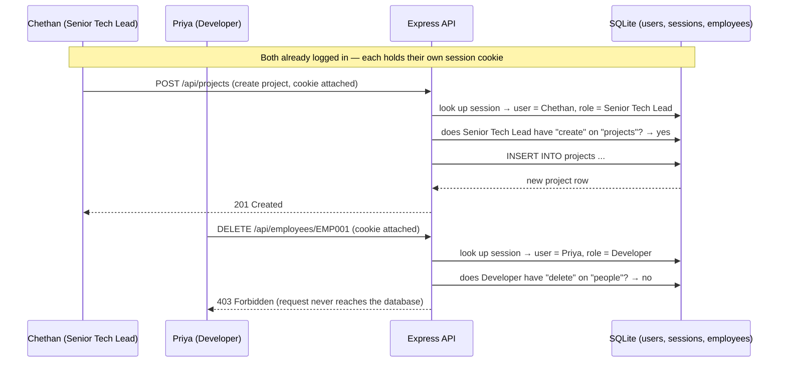

# Real Authentication — Implementation Plan

**Status**: Implemented 2026-08-14. All 10 steps below are done: passwords
are bcrypt-hashed, sessions are real random tokens in an HTTP-only cookie
(`server/security/sessions.ts`), every route requires a valid session
(`server/security/requireAuth.ts`) except `/api/users/authenticate` itself,
module+action permission checks run server-side
(`server/security/permissions.ts`, wired into `_crud.ts` and each custom
route file), logout invalidates the session row, the frontend no longer
uses `localStorage` for session state, and login attempts are rate-limited.
Field-level and data-scope ("own"/"team"/"all") server-side enforcement —
called out in Step 5 as a second-pass item — is **not** done; only
module+action (view/create/edit/delete) checks exist server-side so far.

**Context**: this is "Phase 2 — Real authentication" from
`DATABASE_MIGRATION_PLAN.md` §3, called out there as deliberately deferred
during the JSON→SQLite backend migration, not forgotten. This document is
the full, concrete version of that deferred phase.

---

## Why this exists — the current state (read this first)

The app has a real backend now (Express + SQLite, see
`DATABASE_MIGRATION_PLAN.md` and `PROJECT_DOCUMENTATION.md` §1–§3), but
authentication on it is demo-grade only:

- Passwords are stored and compared **in plaintext** (`server/routes/users.ts`'s
  `/authenticate` endpoint does a raw SQL string match).
- The "session" is just the user's own ID string, stored in the browser's
  `localStorage` (`src/context/AuthContext.tsx`), which any script on the
  page can read or **overwrite** — e.g. setting it to the admin's known ID
  logs you in as them, no password needed.
- The Express API has **no authentication check at all** on any route
  except `/authenticate` itself — every other endpoint
  (`/api/employees`, `/api/projects`, etc.) will serve any request from
  anyone who can reach the port, logged in or not.
- All role/permission enforcement (`canView`, `canEdit`, field-level rules,
  data scope) lives only in the React `usePermission()` hook/`PermissionService`
  — nothing stops a direct API call from bypassing it.

Full plain-language explanation of all of this (with analogies, written for
a junior developer) exists in the conversation that produced this plan —
this document captures the resulting **plan**, not that explanation, so
keep the tone here practical/executable.

---

## Tech stack for this implementation

Deliberately small — mostly reuses what's already in the app.

**Already in the app, no new stack needed:**
- **Express** — the existing backend (`server/`) gains new middleware and
  two new routes; no new framework.
- **SQLite via `better-sqlite3`** — the new `sessions` table is just
  another table, added through the schema-migration system already built
  (`server/db/migrations/`).
- **Node's built-in `crypto` module** — generates the random session token
  (`crypto.randomBytes()`). Ships with Node, no package to install.

**New additions, specifically for this:**
- **`bcryptjs`** — password hashing. The pure-JavaScript implementation,
  deliberately not `bcrypt`, to avoid the native-compile/Visual Studio
  Build Tools issue already hit once on this machine getting
  `better-sqlite3` working.
- **`cookie-parser`** — lets Express read the session cookie off incoming
  requests.
- **`express-rate-limit`** — throttles repeated login attempts on
  `/authenticate`.

**Infrastructure, not an npm package:**
- **HTTPS/TLS certificate** on the VM, so the session cookie travels
  encrypted. A deployment/server-config step, not something `npm install`s.

**Frontend**: no new library at all — a one-line change to the existing
`fetch()` call in `BaseService.ts` (`credentials: "include"`), and removing
the current `localStorage`-based session logic from `AuthContext.tsx`.

---

## How login will work, end-to-end (once implemented)

1. User opens the Login page, types username + password, submits.
2. `AuthContext.login()` → `POST /api/users/authenticate` with
   `{ username, password }`, sent with `credentials: "include"`.
3. Server (`server/routes/users.ts`) looks up the user by username
   (case-insensitive) and reads their stored **bcrypt hash** — not a
   plaintext password.
4. Server runs `bcryptjs.compareSync(password, storedHash)`.
   - No match, or account not `Active` → respond `401 { error: "INVALID_CREDENTIALS" }`.
   - Match → continue.
5. Server generates a random token (`crypto.randomBytes(32).toString("hex")`),
   inserts a row into `sessions` (`token`, `user_id`, `created_at`,
   `expires_at`), and responds success while setting:
   ```
   Set-Cookie: session=<token>; HttpOnly; SameSite=Lax; Secure (in production); Max-Age=604800
   ```
6. The browser stores that cookie itself — React/JavaScript on the page
   **cannot read it** (that's what `HttpOnly` means) — and will
   automatically attach it to every future request to the API, with no
   frontend code needed to "remember" it.
7. Frontend updates `account` in React state from the response, then loads
   the linked `Employee`, `Role`, and `Permissions` exactly as it does
   today, to build the UI's permission evaluator.

On a page reload, instead of reading a `localStorage` key, the frontend
calls `GET /api/auth/me` — the cookie goes along automatically, the server
answers "you're logged in as user X" (200) or "not logged in" (401), and
that's how the session survives a refresh.

## How every other API request will authenticate (once implemented)

This is the part that doesn't exist at all today — every request currently
just runs, no questions asked. Once implemented:

1. User does something in the UI — e.g. clicks "Add Employee." →
   `EmployeeService.create()` → `apiRequest("/api/employees", { method: "POST", ... })`.
2. The browser automatically includes the `session` cookie (because of
   `credentials: "include"`, set up once in `BaseService.ts`) — no code at
   each call site needs to think about this.
3. The request reaches Express. **Before** the actual route handler runs,
   the `requireAuth` middleware (Step 4 of the implementation steps below)
   intercepts it:
   - Reads the `session` cookie.
   - Looks it up in the `sessions` table (joined to `users` for their role).
   - Missing, unknown, or expired → respond `401` immediately; the route
     handler never runs, the database is never touched.
   - Valid → attach `req.user = { id, roleId, ... }` and continue.
4. Next, a `requirePermission("people", "create")` check (Step 5) asks: does
   this specific role have "create" permission on the "people" module?
   - No → respond `403 Forbidden`; still never reaches the database.
   - Yes → continue.
5. Only now does the actual CRUD logic run and write to SQLite.

So authentication ("is this a real, logged-in session?") and authorization
("is this specific role allowed to do this specific thing?") become two
separate, mandatory checkpoints every single request passes through — not
just a one-time check at login that nothing afterward relies on.

## Concrete walkthrough, using this actual application

Two people, two outcomes — the happy path and the rejected path — to make
the enforcement tangible rather than abstract.



> As before: this diagram illustrates the intended behavior for review —
> double-check it against the real implementation once built.

The key difference from today: Priya's delete attempt is rejected by the
**server**, using her real, verified role — not by the UI simply not
showing her a delete button (which a direct API call could ignore
entirely, as it can today).

---

## Step 1 — Hash passwords

- Add **`bcryptjs`** (pure JavaScript) as a dependency — deliberately not
  `bcrypt`, which requires native compilation via `node-gyp` and Visual
  Studio Build Tools, the exact same pain already hit and fixed once for
  `better-sqlite3` on this machine. No reason to reintroduce that risk for
  a second native dependency when a pure-JS equivalent exists.
- Write a one-time script (similar shape to `server/db/migrate.ts`) that
  reads every existing row in the `users` table and replaces its plaintext
  `password` column with `bcryptjs.hashSync(password, 10)`. Run once,
  manually, against the real database — not as a repeatable schema
  migration (this is a data transformation, not a structural change, so it
  doesn't belong in `server/db/migrations/`).
- Update `server/routes/users.ts`:
  - `/authenticate`: fetch the user row by username only, then use
    `bcryptjs.compareSync(inputPassword, row.password)` instead of matching
    password in the `SQL WHERE` clause.
  - The generic CRUD `POST`/`PUT` handlers for `/api/users` (from
    `createCrudRouter` in `_crud.ts`) currently write whatever `password`
    value they're given verbatim — add a hashing step specifically for the
    `password` field before it reaches the generic CRUD insert/update, so
    every path that can set a password (User Management's Add/Edit User
    form, and `EmployeeService.create()`'s auto-account creation) ends up
    hashed, not just the one obvious path.

## Step 2 — Add a `sessions` table

- New file: `server/db/migrations/0001_add_sessions_table.sql` (using the
  schema-migration system already built — see `server/db/migrations/README.md`):
  ```sql
  CREATE TABLE sessions (
    token TEXT PRIMARY KEY,
    user_id TEXT NOT NULL REFERENCES users(id),
    created_at TEXT NOT NULL DEFAULT (datetime('now')),
    expires_at TEXT NOT NULL
  );
  ```
- Pick a session lifetime (e.g. 7 days) and stick to it consistently
  between where it's created (Step 3) and checked (Step 4).

## Step 3 — Issue a real session on login

- In `/authenticate`, on a successful password check: generate a random
  token via Node's built-in `crypto.randomBytes(32).toString("hex")` (no
  new dependency needed), insert it into `sessions` with an expiry, and set
  it on the response as an **HTTP-only cookie**:
  ```ts
  res.cookie("session", token, {
    httpOnly: true,
    sameSite: "lax",
    secure: process.env.NODE_ENV === "production", // requires HTTPS in prod, see Step 8
    maxAge: 7 * 24 * 60 * 60 * 1000,
  });
  ```
- Add the `cookie-parser` package and `app.use(cookieParser())` in
  `server/index.ts` so routes/middleware can read `req.cookies`.
- The `/authenticate` response body no longer needs to hand back anything
  the frontend uses as "the session" — the cookie is the session now.

## Step 4 — Add auth-checking middleware

- New file: `server/middleware/requireAuth.ts` — reads `req.cookies.session`,
  looks it up in `sessions` (join to `users` to also pull `role_id`),
  checks `expires_at` hasn't passed, and either:
  - Attaches the result to `req.user` and calls `next()`, or
  - Responds `401 { error: "UNAUTHENTICATED" }` if missing/invalid/expired.
- In `server/index.ts`, apply it to every router **except** the
  `/authenticate` route itself — e.g. mount auth-required routers after
  `app.use(requireAuth)`, but register `POST /api/users/authenticate`
  before that middleware runs (or exempt that one path explicitly).

## Step 5 — Add server-side permission checks

- Port the essential logic from `src/security/PermissionService.ts` (the
  evaluator behind `canView`/`canCreate`/`canEdit`/`canDelete` per module)
  into a server-side equivalent — this can likely be a near-direct copy
  since the underlying `ModulePermission` data (roles/permissions tables)
  is the same data the frontend already fetches from `/api/roles` and
  `/api/permissions`.
- Add a small middleware factory, e.g. `requirePermission(module, action)`,
  and apply it per-route in each `server/routes/*.ts` file — e.g. the
  `DELETE` handler for employees requires `requirePermission("people", "delete")`.
  Start with module+action level checks (view/create/edit/delete) as the
  first pass; field-level and data-scope ("own"/"team"/"all") enforcement
  can follow as a second pass since it's a bigger lift — call this out
  explicitly if only doing a first pass, don't silently skip it.

## Step 6 — Real logout

- Add `POST /api/auth/logout`: delete the matching row from `sessions` by
  token, then `res.clearCookie("session")`.
- Update `AuthContext.logout()` (`src/context/AuthContext.tsx`) to call
  this endpoint instead of only clearing local React state.

## Step 7 — Update the frontend to match

- `src/services/BaseService.ts`'s `apiRequest()`: add `credentials: "include"`
  to the `fetch()` call so the browser actually sends the session cookie
  with every request (cookies aren't sent cross-origin/by `fetch` by
  default without this).
- Remove the `localStorage["ai-portfolio-dashboard.session"]` mechanism
  entirely from `AuthContext.tsx`.
- Add `GET /api/auth/me` on the server (uses `requireAuth`, just returns
  `req.user`) and call it on app load in `AuthContext`'s session-restore
  effect instead of reading a `localStorage` key — a 401 response means
  "not logged in," a 200 means restore that user.
- In `server/index.ts`, update `cors()` to explicitly allow credentials —
  this is required once cookies are involved and doesn't work with a
  wildcard origin:
  ```ts
  app.use(cors({ origin: "http://<the-actual-frontend-origin>", credentials: true }));
  ```

## Step 8 — HTTPS on the VM

- Out of scope for local dev (session cookie's `secure` flag should stay
  conditional on environment, as shown in Step 3, so local `http://localhost`
  testing keeps working).
- For the actual dev/production VM: obtain a TLS certificate (an internal
  company-issued one is fine, doesn't need to be public-CA), terminate it
  either directly in Express or via a reverse proxy in front of it, and
  confirm the cookie's `secure: true` path is actually active there.

## Step 9 — Rate-limit login attempts

- Add `express-rate-limit`, apply a limiter (e.g. 10 attempts per 15
  minutes per IP) specifically to `POST /api/users/authenticate`.

## Step 10 — Verification checklist before calling this done

- [ ] Existing seeded demo accounts (`admin`/`Admin@123`, etc.) still log
      in successfully after their passwords are hashed by the one-time script.
- [ ] A normal login → reload → still logged in (via `/api/auth/me`, not `localStorage`).
- [ ] Logout actually invalidates the session server-side — the old cookie
      value, if reused, gets a 401.
- [ ] A direct `curl`/Postman request to any protected endpoint with no
      cookie gets 401.
- [ ] A direct request with an expired or made-up session token gets 401.
- [ ] A logged-in Developer-role session calling an admin-only action
      (e.g. deleting an employee) gets rejected **server-side** (403), not
      just hidden in the UI.
- [ ] `npx tsc --noEmit -p tsconfig.app.json` and `-p server/tsconfig.json`
      both pass clean.
- [x] Update `PROJECT_DOCUMENTATION.md` §6.1 and §22 (which currently and
      correctly describe the *old* demo-auth behavior) to reflect the new
      flow, and add a changelog entry there. Also mark this document's
      **Status** line at the top as "Implemented" with the date, and update
      `DATABASE_MIGRATION_PLAN.md`'s Phase 2 bullet to point here as resolved.

### Note from implementation: the Node 24.19 / better-sqlite3 crash — found, and fixed 2026-08-14

Earlier troubleshooting in this project treated the native crash
(`Assertion failed: (env) != nullptr` in `node::RemoveEnvironmentCleanupHook`)
as a shutdown-only cosmetic issue. During this implementation it recurred
**during live request handling**, not just at shutdown, including
repeatedly interrupting the one-time password-hashing script mid-run (it
had to be run in a loop ~10 times, each attempt making partial progress
before crashing, until every row was hashed) — and it caused a real,
user-visible failure: a signed-in user's login attempt hit a server that
had silently died in the background.

**Fixed** by upgrading `better-sqlite3` from `11.10.0` to `13.0.3`
(`npm install better-sqlite3@latest`). The older version had to be
compiled locally via `node-gyp` (the whole Visual Studio Build Tools saga
earlier in this project); `13.0.3` ships prebuilt native binaries for
every platform (`node_modules/better-sqlite3/prebuilds/`), including
`win32-x64` — no local compilation at all anymore, which also removes 34
now-unneeded build-tooling packages from `node_modules`.

**Verified**: 25 rapid-fire failed-login requests (correctly rate-limited
after 10) plus 9+ consecutive fresh-process script runs against the live
database, all against the same running server process, with zero crashes
— versus the old version, which crashed on nearly every single such
attempt during this same implementation work. Treat this as resolved,
not just improved, unless it resurfaces.

The previous recommendation (upgrade `better-sqlite3`, or run under an LTS
Node version) is now: upgrade `better-sqlite3`, done. Running under Node
24.19 with the current version appears fine — no need to change Node
versions unless this recurs. This is no longer a blocker before relying
on this app for real use — a production server that can silently die under
load was the real risk, and it's what the
disaster-recovery plan in `DATABASE_MIGRATION_PLAN.md` §8 does not cover.
