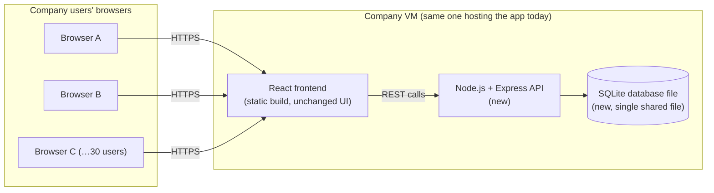
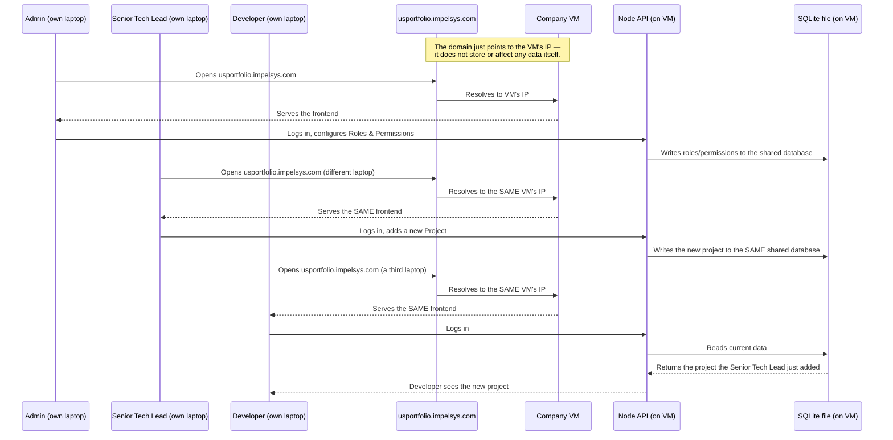

# Database Migration Plan — JSON Files → SQLite + Backend API

**Status**: Proposal for review — nothing in this document has been implemented yet.
**Last updated**: 2026-08-08

This document explains, in plain terms, two things:

1. **Why the current JSON-file + `localStorage` setup is not sufficient** now that
   the dashboard needs to be a genuinely shared, multi-user tool.
2. **A concrete plan** to move to a real shared database (SQLite) behind a small
   backend API, hosted on the same company VM, along with the impact that
   change has on the codebase, on operations, and on the team.

Read this before any migration work starts — several of the decisions below
(database engine, hosting approach, auth model) were already discussed and
agreed in conversation; this document is the write-up of that discussion so
it can be reviewed properly rather than just implemented from a chat log.

---

## 1. Why Change? Drawbacks of the Current System

The application today stores all data as JSON files in `src/data/`, and any
change a user makes (adding an employee, creating a project, logging an
activity, etc.) is written to that browser's own `localStorage` — never back
to the JSON file, never to any shared location. This was a deliberate,
reasonable choice for an early, single-developer, no-backend build. It has,
however, several real limitations now that ~30 people are expected to use
this as a shared tool.

### 1.1 No shared data — the core problem

`localStorage` is scoped **per browser, per device, per origin**. Even
though the app is hosted centrally on the VM, each person's browser keeps
its own private copy of "the data." If you add a project on your machine,
it exists only in your browser. A colleague opening the same URL on their
own laptop sees the original JSON seed data plus whatever *they've* changed
— not what you changed. There is currently no single source of truth that
everyone reads from. This is the problem that started this whole
discussion, and it cannot be fixed by editing JSON files differently — it
requires a server that all browsers talk to.

### 1.2 Data loss risk

`localStorage` is not backed up anywhere. If someone clears their browser
data, reinstalls their OS, switches browsers, or their browser's storage
quota is hit, **everything they entered is gone permanently**, with no
recovery path. There is no "restore from yesterday" for a `localStorage`
based system.

### 1.3 No protection against concurrent writes

Every service (`EmployeeService`, `ProjectService`, etc.) works the same
way: read the entire array from storage, modify it in memory, write the
entire array back. If two browser tabs (or two people, once this is
shared) write at nearly the same time, the second write silently
overwrites the first with no warning, no conflict detection, no merge. In
a real shared system this would cause quietly lost updates.

### 1.4 Security exposure

Employee names, emails, roles, and activity data currently sit in plain,
readable JSON inside `localStorage`, visible to anyone with access to that
browser's DevTools. Field-level and role-based permission checks
(`canViewField`, `canEditField`, etc.) are enforced only in the React code
— a determined user could bypass them from the browser console, since
there is no server checking anything. This is an accepted tradeoff for a
single-user local tool; it is not acceptable once the data is meant to be
genuinely access-controlled across a team.

### 1.5 No audit trail

There is no record of who changed what and when. If a project's team
membership or an employee's role changes, there is no history to look
back on — only the current state.

### 1.6 No backup or recovery process

Because there's no central store, there is nothing to back up. "Backup"
today would mean asking every individual user to export their own browser
data — impractical and something nobody is actually doing.

### 1.7 A scalability ceiling

Every read/filter/sort operation happens by loading the *entire* JSON
array into memory and processing it in JavaScript on each page view. This
is fine at today's scale (~35 employees, a handful of projects) but has no
real querying, indexing, or pagination — it will not scale gracefully as
years of activity/learning/task history accumulate.

### 1.8 No multi-device access

Since data lives in one browser's storage, a person cannot check the
dashboard from their phone or a second computer and see the same
information they see at their desk. A truly "hosted on a VM" app should
behave the same regardless of which device opens it — today it doesn't.

---

## 2. Target Architecture

The plan is to introduce a small backend API and a real database, both
running on the same company-controlled VM the app is already hosted on —
no data leaves company infrastructure.

> **Note**: this is a proposed architecture diagram, not a finished
> design — please review it carefully before treating it as final, as
> details (ports, process manager, reverse proxy) will be refined during
> implementation.

**What each piece does:**

- **React frontend** — almost entirely unchanged. It keeps its component
  structure, pages, and UI; it currently already talks to "services"
  (`EmployeeService`, `ProjectService`, …) rather than touching JSON
  directly, which is exactly what makes this migration contained.
- **Node.js + Express API (new)** — a small server that exposes one set of
  endpoints per entity (e.g. `GET/POST/PUT /api/employees`,
  `GET/POST/PUT/DELETE /api/projects`, …), mirroring the methods each
  `*Service.ts` already has today (`getAll`, `create`, `update`, `delete`).
  It also becomes the one place that actually checks permissions and
  authenticates users — closing the "DevTools bypass" gap above.
- **SQLite database file (new)** — one shared file on the VM's disk,
  holding every table (employees, projects, activities, tasks, learning
  records, POCs, settings, roles, permissions). This is the new single
  source of truth every browser reads from and writes to, replacing both
  the JSON seed files and `localStorage`.

---

## 3. Migration Plan

### Phase 0 — Schema design & planning
- Convert each existing JSON shape (`Employee`, `Project`, `Activity`,
  `Task`, `POC`, `LearningRecord`, `Role`, `ModulePermission`, `Settings`,
  …) into a relational table design (primary keys, foreign keys — e.g.
  `Project.members` becomes a proper join table instead of an array of
  ids embedded in one row).
- Decide on the SQLite driver: Node's built-in `node:sqlite`, or the
  well-established `better-sqlite3` package.
- Decide on a lightweight migration tool/approach so schema changes are
  versioned and repeatable (not manual one-off edits to the database).

### Phase 1 — Backend scaffolding
- Stand up a small Express project alongside the existing frontend.
- Create the SQLite database and initial schema via the first migration.
- Implement REST endpoints for each entity, matching today's service
  method names/behaviour so the mapping to the frontend is mechanical.

### Phase 2 — Real authentication
- Today, login checks a JSON user list entirely in the browser — anyone
  could edit that data client-side. Move this server-side: passwords
  hashed and checked on the server, and a real session/token
  (e.g. a signed cookie or JWT) issued on login and checked on every API
  request.
- Re-implement the existing role-based permission checks
  (`canView`, `canEdit`, field-level rules, data scope "own/team/all") on
  the **server**, not just in the React `usePermission()` hook — the hook
  can stay for UI purposes (hiding buttons, etc.) but must no longer be
  the only enforcement.

### Phase 3 — Frontend service layer swap
- Rewrite each `src/services/*.ts` file so its methods call the new API
  (`fetch`/`axios`) instead of reading/writing `localStorage`. Method
  signatures stay the same wherever possible, so components using
  `employeeService.getAll()` etc. need little or no change — this is the
  direct payoff of the existing "components call services, never JSON
  directly" rule.
- Replace the mock login flow with a real call to the new auth endpoint.

### Phase 4 — Data migration
- Write a one-time script that reads the current seed JSON (and, if
  needed, any real data already sitting in someone's browser on the
  existing dev/production VM) and inserts it into the new SQLite database.
- Validate row counts and spot-check records after import.

### Phase 5 — Deployment on the VM
- Install Node.js on the VM if not already present.
- Run the Express API as a persistent background service (e.g. via PM2,
  or wrapped as a Windows Service with NSSM) so it survives reboots.
- Point the frontend at the API's address; add a reverse proxy in front if
  needed so both frontend and API are reachable behind one hostname.
- Put a backup routine in place for the SQLite file (a scheduled copy of
  the file is sufficient at this scale).

### Phase 6 — Testing & cutover
- Run the new system in parallel with the current one (a "dev"/staging
  pass) with the team testing real workflows.
- Pick a low-activity window to cut production over, take a final backup
  of the old JSON/localStorage-based build beforehand as a fallback.

### Phase 7 — Future/optional (not in this plan's initial scope)
- Real-time updates or in-app notifications (covered separately — this
  needs polling or WebSockets on top of the backend above; deliberately
  left out of the initial migration to keep scope contained).

---

## 4. Impact Assessment

### Code impact
- **Every file in `src/services/`** is rewritten (internals only — most
  callers in components/pages should be unaffected).
- **`src/data/*.json`** stop being the runtime data source and become
  one-time seed/migration input only.
- **Auth** (`AuthContext`, login flow, `UserService`) is substantially
  reworked to talk to a real server-side auth endpoint.
- **`CLAUDE.md`** needs to be updated — it currently states explicitly "No
  backend. No Express. No Node API. No database," which this migration
  directly reverses. This should be a deliberate, visible edit, not left
  inconsistent with the code.
- UI components, pages, routing, and the permission *model* (roles,
  scopes, field rules) stay conceptually the same — only where they're
  *enforced* changes (adds server-side enforcement, keeps client-side for
  UI purposes).

### Operational impact
- The app changes from a **zero-maintenance static site** to a system with
  a **running background service** (the API) that needs to be:
  restarted if it crashes, monitored, and included in any VM
  reboot/maintenance planning.
- A **backup routine** needs to exist and be tested (currently there is
  none, because there's nothing central to back up).
- Deploys gain one extra step: running any pending database migrations
  after pulling new code (covered in the earlier discussion in this
  conversation).

### Security impact (net positive, with a new consideration)
- Real login and real permission checks close the current "anyone can
  bypass rules via DevTools" gap.
- The API server is a new network-facing component on the VM and needs
  the same basic hardening attention as any server software (kept
  internal to the company network, not exposed externally, credentials
  handled properly).

### Effort and risk
- This is a genuinely large change — realistically measured in **days to
  a few weeks** of focused work, not a quick patch, since it touches
  authentication, every data service, and deployment.
- Main risk areas: getting the schema design right the first time
  (harder to change later once real data exists), correctness of the
  one-time data migration script, and making sure the native SQLite
  driver is built correctly on the VM (addressed by always running
  `npm install` on the VM itself, as discussed earlier).

### What does **not** change
- The React/TypeScript/Tailwind/shadcn frontend stack.
- The overall page structure, navigation, and UI design.
- The *concepts* of roles, permissions, and data scopes — only where they
  are enforced changes.
- The "components call services" architecture rule — it's precisely what
  makes this migration contained instead of a full rewrite.

---

## 5. Recommendation

Proceed in the phased order above, treating Phase 0 (schema design) as the
most important step to get right before writing any backend code, since
it's the hardest to change after real data exists. Everything through
Phase 6 should be planned and reviewed before a production cutover date is
set; Phase 7 (real-time/notifications) is intentionally deferred to a
later, separate effort so this migration has a contained, achievable
scope.

---

## 6. Alternative: Using PostgreSQL Instead of SQLite

This section covers what changes if PostgreSQL is chosen instead of
SQLite. The **outcome is identical either way** — a real shared database
behind the API, fixing the "everyone sees the same data" problem. The
difference is entirely in operational overhead and a few code-level
details, not in what the app can do.

### 6.1 The core difference

SQLite is an embedded **library** — there is no separate database process;
the Node API just opens a file. PostgreSQL is a full **client-server
database** — it runs as its own standalone service on the VM, listening on
a network port, with its own login credentials, completely independent of
the Node API process. Choosing Postgres means you are now running and
owning a second piece of server software on the VM, not just the API.

### 6.2 Additional operational impact

| Concern | SQLite | PostgreSQL |
|---|---|---|
| Install | Nothing to install — bundled in the Node driver | Install PostgreSQL Windows service on the VM |
| Running process | None — just a file | A persistent background service that must stay up, survive reboots, and be monitored |
| Network exposure | None — not a network service | Listens on a TCP port (default 5432); must be locked down to localhost-only if API and DB share the VM |
| Credentials | None needed | A dedicated database user/role and password to create and manage, separate from the app's own login system |
| Backup | Copy one file | Scheduled `pg_dump` (or similar) job, plus periodically-tested restores |
| Upgrades | None — tied to the Node driver version | Periodic PostgreSQL version upgrades, occasionally requiring a deliberate migration step |
| Resource usage | Effectively zero when idle | Persistent background memory/CPU footprint even when nobody is using the app |
| SQL feature set | Simpler, sufficient for this scale | Richer (window functions, native JSON columns, full-text search, more advanced indexing) |
| Best fit | Small teams (~30 users), light concurrent writes | Larger scale, heavier concurrency, advanced reporting needs, or when a managed Postgres is already provided by IT |

### 6.3 Impact on the migration plan phases (Section 3)

- **Phase 0 (Schema design)**: largely the same relational design; a few
  data types map more naturally to Postgres (native `JSON`/`JSONB`
  columns, real sequence-based auto-increment) versus SQLite's simpler
  type system.
- **Phase 1 (Backend scaffolding)**: swap the SQLite driver for a
  PostgreSQL driver (commonly `pg`/`node-postgres`), and add basic
  connection-pool configuration (Postgres expects a managed pool of
  connections rather than one direct file handle).
- **Phase 4 (Data migration)**: same one-time import approach, targeting
  a Postgres database instead of a SQLite file.
- **Phase 5 (Deployment)**: gains the extra install/configuration process
  detailed in 6.4 below, plus a real backup schedule (there is no
  "copy the file" shortcut with Postgres).
- **Ongoing operations**: someone now explicitly owns database uptime,
  backup verification, and periodic version upgrades — a standing
  responsibility that doesn't exist with SQLite.

### 6.4 Step-by-step process if PostgreSQL is chosen

1. **Install** PostgreSQL for Windows on the VM (official installer or a
   package manager), setting a strong password for the default
   `postgres` superuser during setup.
2. **Create a dedicated database** for this app (e.g. `portfolio_dashboard`)
   and a **dedicated application role/user** with only the privileges it
   needs on that database — never have the app connect as the superuser.
3. **Restrict network exposure**: set `listen_addresses = 'localhost'` in
   `postgresql.conf` (since the API and database run on the same VM, the
   database never needs to accept connections from anywhere else), and
   configure `pg_hba.conf` to allow only local, password-authenticated
   connections.
4. **Configure the API**: install the `pg` driver in the Node project and
   store the connection details (host, database name, user, password) in
   an environment variable/config file — never hard-coded in source
   control.
5. **Run schema migrations** against the new Postgres database, using the
   same migration approach planned for SQLite in Phase 0, just pointed at
   Postgres.
6. **Set up scheduled backups**: a recurring `pg_dump` job (e.g. via
   Windows Task Scheduler) writing to a backup location, with periodic
   test restores to confirm the backups are actually usable.
7. **Verify and monitor**: confirm the API connects successfully, check
   logs after deployment, and include the PostgreSQL service in the VM's
   restart/monitoring routine going forward.

### 6.5 Bottom line

Functionally, SQLite and PostgreSQL solve the exact same problem here —
there is no scenario at ~30 users where Postgres enables something SQLite
can't. The choice comes down to whether the extra operational ownership
(install, credentials, network config, backup jobs, version upgrades) is
worth taking on now. The recommendation in Section 5 stands: use SQLite
unless there's a specific reason to prefer Postgres — most commonly,
IT already providing and managing a Postgres instance for you, which would
remove most of the overhead in the table above.

---

## 7. Real-World Scenario Walkthrough (SQLite Setup)

To make this concrete, here's a worked example using the exact setup
described: the app hosted on the company VM, a domain
(`usportfolio.impelsys.com`) pointed at that VM's IP, and three different
people logging in from three different machines.

### 7.1 The setup

> Note: this diagram illustrates the intended flow for review — please
> double-check it against the actual implementation once built, as AI-
> generated diagrams can miss real-world edge cases.

### 7.2 Walking through it step by step

1. **You (Admin)** open `usportfolio.impelsys.com`, log in, and go into
   Roles & Permissions to set up who can see/do what. This is no longer
   saved to *your* browser only — the API saves it into the one shared
   SQLite file sitting on the VM.
2. **Your colleague, the Senior Tech Lead**, opens the exact same URL from
   their own laptop, logs in with their own account, and adds a new
   project. The domain name (`usportfolio.impelsys.com`) is just a
   friendly address that points to the VM — every single user's browser
   is ultimately talking to the same VM, the same API, and now, the same
   database file. Their "add project" action writes to that one shared
   file.
3. **The Developer** opens the same URL from a third laptop and logs in.
   Their browser fetches the People/Projects data fresh from the API,
   which reads from that same shared SQLite file — so they see the
   project the Senior Tech Lead just added, plus whatever the Admin
   configured, without doing anything special.

### 7.3 Direct answer to "will all three see the same data?"

**Yes — all three will see the same data**, because after this migration,
"the data" exists in exactly one place (the SQLite file on the VM) rather
than one place per browser. The shared domain isn't what makes this work
(today's JSON/`localStorage` app is *also* reached through one shared URL,
and still doesn't share data — that's the whole problem this migration
fixes); what makes it work is that every browser now talks to the same
backend and database instead of keeping its own local copy.

**"At the same time, obviously on reload" is exactly right, with one
nuance already covered in Section on real-time behavior earlier in this
conversation**: if the Developer's browser tab was already open *before*
the Senior Tech Lead added the project, it won't magically appear without
a refresh or navigating to that page — the app fetches on page load/
navigation, not continuously. But the moment the Developer reloads the
page, opens the Projects page, or logs in fresh, they get the current,
shared, up-to-date data — every time, for every user, regardless of which
machine or browser they're using.

### 7.4 One more nuance: shared data ≠ identical view

All three users read from the same underlying data, but **what each of
them sees and can do is still governed by their role's permissions** —
that part doesn't change. For example, the Developer might have "own
data" scope on some modules and only see their own record, while the
Senior Tech Lead sees the full team. Both are looking at the same single
source of truth; permissions decide what's *filtered out* of the view for
each of them, not which copy of the data they're looking at.

---

## 8. Disaster Recovery & Backup Plan

This is the most important section to get right before going live with a
shared database, because it's the one thing that turns "someone made a
mistake" or "the VM had a bad day" from a minor inconvenience into
permanent data loss. It should be settled **before** the migration ships,
not improvised after something goes wrong.

### 8.1 What actually needs protecting

| Asset | How it's protected today (JSON/localStorage) | How it must be protected after migration |
|---|---|---|
| Application code | Git (already safe) | Git (unchanged — no new risk here) |
| The actual data | Not centrally protected at all — lives per-browser | The single SQLite file becomes the one thing that, if lost, cannot be regenerated |
| Server/VM configuration | N/A (static site) | New: Node install, service configuration, reverse proxy, certificates — needs to be documented, not just remembered |

The database file is the new single point of failure this migration
introduces. Everything else (code, config) is either already safe in git
or can be reconstructed from documentation. **The backup plan exists
almost entirely to protect that one file.**

### 8.2 Failure scenarios to plan for

1. **VM has a transient problem** (needs a reboot, OS hiccup) — the VM
   itself survives, disk is intact. Lowest severity.
2. **Disk/VM corruption or hardware failure** — the VM or its disk is
   lost entirely; nothing on it is recoverable.
3. **Bad deploy or migration** — a code or schema change corrupts data or
   behaves unexpectedly (e.g. a migration that wasn't tested properly).
4. **Human error** — someone deletes records they shouldn't have, or an
   admin action has an unintended side effect.
5. **Accidental file loss** — the database file itself is deleted,
   overwritten, or corrupted (e.g. the VM loses power mid-write).

A good backup plan needs to cover all five — not just "the VM exploded."
Scenarios 3–5 are actually the more common ones in practice for a small
internal tool, not catastrophic hardware failure.

### 8.3 Backup strategy for SQLite

Because SQLite is a single file, "backup" is conceptually simple — copy
the file — but it has to be done correctly:

- **Never copy the raw file while the app is actively writing to it** —
  this can capture it mid-write and produce a corrupt backup. Use
  SQLite's own safe backup mechanism instead (its `.backup` command, or
  `VACUUM INTO 'backup-file.db'`), which produces a consistent snapshot
  even while the database is in use.
- **Automate it on a schedule** — e.g. a nightly job (Windows Task
  Scheduler running a small script) that produces a timestamped backup
  file.
- **Keep a rolling retention window**, not just the latest copy — e.g.
  14 daily backups plus a handful of weekly ones — so a problem that
  isn't noticed for a few days can still be recovered from an
  earlier point.
- **Store backups somewhere other than the same disk/VM.** This is the
  single most important rule and the one most often skipped: if backups
  live on the same disk as the live database, losing that disk loses
  both the data *and* the backups at once. Copy backups to a second
  company-controlled location — another server, a network share, or
  whatever backup/NAS solution your IT team already runs. (Given the
  earlier requirement that data stay on company infrastructure, this
  should be another internal location, not a third-party cloud service.)

*(If PostgreSQL is chosen instead — see Section 6 — the same principles
apply, but the mechanism is a scheduled `pg_dump`/`pg_basebackup` instead
of a file copy, and optionally WAL archiving if near-zero data loss is a
requirement. Worth asking IT whether they already run backups for other
Postgres instances the company operates, which could cover this one too.)*

### 8.4 VM-level protection (covers total VM loss)

Ask your IT/infrastructure team whether the VM is already covered by:
- **Scheduled VM snapshots or images** (common with Hyper-V/VMware or
  whatever virtualization platform hosts it) — this can restore the
  *entire* VM (OS, Node, the app, and the database as it existed at
  snapshot time) in one step, and is often already standard practice for
  company-managed VMs regardless of this project.
- If VM-level snapshots already exist, they're a strong complementary
  safety net on top of the application-level database backups in 8.3 —
  but shouldn't be the *only* backup, since snapshot frequency is usually
  daily at best and is managed by IT, not by this application's own
  schedule.

### 8.5 Recovery process (what actually happens)

**If the VM just needs a restart** (Scenario 1): configure the Node API
to auto-start on boot (via the same service wrapper mentioned in Section
3, Phase 5) so recovery is just "the VM comes back up and the app comes
back with it" — no manual steps.

**If the VM/disk is lost entirely** (Scenario 2): this is where having a
documented process matters —
1. Provision a new VM (or restore the IT-managed VM snapshot, if one
   exists and is recent enough).
2. Re-run the documented setup steps (install Node, install the
   SQLite/Postgres driver dependencies, configure the service and reverse
   proxy) — this is why Section 3/6.4's setup steps should be written
   down as a runbook, not left as tribal knowledge.
3. Pull the latest application code from git.
4. Restore the most recent off-VM database backup onto the new machine.
5. Point the domain (`usportfolio.impelsys.com`) at the new VM's IP if it
   changed.
6. Verify: log in, spot-check recent data, confirm the app behaves
   normally.

**If it's a bad deploy, human error, or accidental deletion** (Scenarios
3–5): restore just the database file from the most recent good backup —
no VM rebuild needed. This is the more common real-world use of backups
for a small internal tool, and is exactly why frequent, short-interval
backups (nightly, not weekly) matter more than they might seem to.

### 8.6 Define acceptable data loss and downtime up front

Two numbers should be explicitly agreed before go-live, not assumed:

- **RPO (Recovery Point Objective)** — how much data are you willing to
  lose in the worst case? Nightly backups mean "up to 24 hours of the
  most recent changes" in a worst-case scenario. If that's too much,
  backups need to run more frequently.
- **RTO (Recovery Time Objective)** — how long can the app reasonably be
  down while it's restored? For an internal ~30-person tool that isn't
  mission-critical minute-to-minute, a target of a few hours is typically
  reasonable — but that's a decision for you/leadership to confirm, not
  an assumption to bake in silently.

### 8.7 Backups are only real if restores are tested

An untested backup is a guess, not a safety net. Recommend a periodic
(e.g. quarterly) restore drill: take a real backup file, restore it to a
throwaway test instance, and confirm the data is intact and the app
starts up normally against it. This is the step most commonly skipped —
and the one that matters most when an actual emergency happens.

### 8.8 Concrete recommendation for this app's scale

- Nightly automated SQLite backup using the safe `.backup`/`VACUUM INTO`
  method, retained on a rolling window (e.g. 14 daily + a few weekly),
  copied to a second company-controlled location — not just another
  folder on the same VM.
- Confirm with IT whether VM-level snapshots already cover this machine;
  if so, treat that as a bonus safety net, not a replacement for 8.3.
- Make sure the application's git repository is pushed to a real remote
  (not only committed locally), so code isn't lost alongside the VM.
- Write down the VM setup steps as a short runbook while doing the
  migration (Section 3/6.4 are the starting point) — future-you during an
  actual outage will not want to reconstruct these steps from memory.
- Run a real restore test at least once before go-live, and periodically
  afterward (quarterly is a reasonable cadence for a tool this size).
